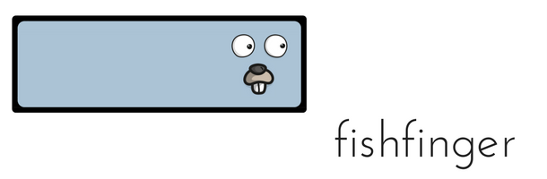

[](https://godoc.org/github.com/timtosi/fishfinger)
[](https://goreportcard.com/report/github.com/timtosi/fishfinger)

## What is FishFinger ?
FishFinger is a Dockerfile and Docker-Compose lightweight programmatic library
written in Go. This project provides easy to use abstractions of official Docker
libraries with no other dependency than [official Go library](https://github.com/golang/go)
and [official Docker libraries](https://github.com/docker/).

FishFinger also provides a one possible solution to deal with [container initialization delay](https://github.com/docker/compose/issues/374)
and makes room for further improvement through user-defined solutions.

This project is fully tested and comes with an [extensive documentation](https://godoc.org/github.com/timtosi/fishfinger).

## Quickstart

First of all, you need to install and configure the latest [Docker version](https://docs.docker.com/engine/installation/)
on your machine.

Then go get this repository:
```golang
go get -d github.com/timtosi/fishfinger
```

Finally, check how to use the components provided:

* [Use one or more services from a Compose file](#basic-compose-usage)
* [Use one or more services from a Compose file with a Backoff](#backoff-compose-usage)

## Use a Compose File

The `fishfinger.Compose` component represents an abstraction of the [libcompose](https://github.com/docker/libcompose)
library. It provides functions allowing the user to use a [Compose file](https://docs.docker.com/compose/compose-file/)
programmatically.

An extensive documentation of this component is available [here](https://godoc.org/github.com/TimTosi/fishfinger).

### Basic Compose Usage

Let's say you have a [basic Compose file](examples/compose-basic/docker-compose.yaml)
where you defined three redis services.

For instance, you could want to be able to write a test suite that will directly
make use of your containers instead of simply mocking their behaviour through
burdensome to write functions.

First of all, let's create a new Compose file handler by using the
`fishfinger.NewCompose` function that takes the path to your Compose file as an
argument.

```go
func main() {
	c, err := fishfinger.NewCompose("./docker-compose.yaml")
	if err != nil {
		log.Fatal(err)
	}
}
```

Time to start services.

```go
func main() {
	c, err := fishfinger.NewCompose("./docker-compose.yaml")
	if err != nil {
		log.Fatal(err)
	}
    if err := c.Start(); err != nil {
		log.Fatal(err)
	}
}
```

As no argument is provided, all services will be started, but `Compose.Start`
function accepts a variable number of service name in argument and will start
them in the order specified.

At this stage, you should have a neat redis cluster running. The Redis client
ports you previously set for each of your services are the `6379` but you had to
specify different available ports on your host machine. You can hard code the
different ports OR you can use the `Compose.Port` function to find the correct
port to use from a service name and the combination of the port exposed and the
protocol used such as `6379/tcp`. This function returns the full address in the
following form `<host>:<port>`.

```go
func main() {
	c, err := fishfinger.NewCompose("./docker-compose.yaml")
	if err != nil {
		log.Fatal(err)
	}
    if err := c.Start(); err != nil {
		log.Fatal(err)
	}
    addr, err := c.Port("redis-01", "6379/tcp")
	if err != nil {
		log.Fatal(err)
	}
}
```

The `Compose.Port` function will return the full address in the following form
`<host>:<port>`. Now you can instanciate your redis client and do whatever stuff
you want.

In the end, you maybe want to clean the containers created. Just use the
`Compose.Stop` function just as you would use the `Compose.Start` function.

```go
func main() {
	c, err := fishfinger.NewCompose("./docker-compose.yaml")
	if err != nil {
		log.Fatal(err)
	}
    if err := c.Start(); err != nil {
		log.Fatal(err)
	}
    addr, err := c.Port("redis-01", "6379/tcp")
	if err != nil {
		log.Fatal(err)
	}
    if err := c.Stop(); err != nil {
		log.Fatal(err)
	}
}
```
As no argument is provided, all services will be stopped.

Complete working code can be found [here](examples/compose-basic/main.go).


### Backoff Compose Usage

When you want to use Docker in a programmatic way, you can encounter a particular
issues regarding the definition of a container's `ready` state: the container state
and the state of the software running inside the container are decoupled.

That means a container will be considered `ready` regardless of the software
state, leading to programmatic errors. Moreover, that is not because the main
dockerized software is running that you consider your container ready.

Let's say you have a [basic Compose file](examples/compose-backoff/docker-compose.yaml)
where you defined a service running a SQL database. In this case, you are using
it for testing purposes because you do not want to use a mocking driver.
Basically, you could build an image with all your data preloaded but currently
you do not want to rebuild your image each time you update your dataset because
it's evolving frequently. 

As you can see at [line #40](examples/compose-backoff/docker-compose.yaml#L40),
in this example, you find a solution by using a container that mounts a volume
where you put all .sql scripts you use for populating the database at
initialization.

Here is a visualisation of the three `ready` states this Docker container has :

```
+--------------------+     +-------------+     +-------------------+
| CONTAINER IS READY | --> | MYSQL IS UP | --> | DATA ARE INSERTED |
+--------------------+     +-------------+     +-------------------+
```

You can't rely on Docker to know when your container is ready and you can't rely
on a time constant because the data insertion step is variable depending on the
data you will have to set.

There are several ways to tackle this problem and FishFinger allow you to resolve
this easily by using the `Compose.StartBackoff` function.

First of all, let's create a new Compose file handler by using the
`fishfinger.NewCompose` function that takes the path to your Compose file as an
argument.

```go
func main() {
	c, err := fishfinger.NewCompose("./docker-compose.yaml")
	if err != nil {
		log.Fatal(err)
	}
}
```

Now, time to start the MySQL service with the `Compose.StartBackoff` function.


```go
func main() {
	c, err := fishfinger.NewCompose("./docker-compose.yaml")
	if err != nil {
		log.Fatal(err)
	}

	if err := c.StartBackoff(fishfinger.SocketBackoff, "datastore"); err != nil {
		log.Fatal(err)
	}
}
```

This function takes two arguments: the Backoff function used and a list of
service name that will be started by this function call. The Backoff function
used here is the one provided by default by the Fishfinger project but you are
expected to provide another one that suits your need.


```go
func SocketBackoff(c *Compose, service string) error {
	var (
		msg  string
		conn net.Conn
	)

	addr, err := c.Port(service, "9090/tcp")
	if err != nil {
		return err
	}
	for ; msg != "ready\n"; time.Sleep(5 * time.Second) {
		if conn, err = net.Dial("tcp", addr); err == nil {
			fmt.Fprintf(conn, "ready\n")
			msg, _ = bufio.NewReader(conn).ReadString('\n')
			conn.Close()
		}
		fmt.Printf("Retry connection in 5s.\n")
	}
	return nil
}
```

It's only keep trying to connect to a specific port exposed by the container.
The fact is the function will not find any remote listener until all data is
correctly loaded, as you can see [here](https://github.com/TimTosi/mechanist/blob/master/sql/mysqld.sh#L26L29).
In this way, you are assured everything is ready to be processed by the rest of
your program.

Complete working code can be found [here](examples/compose-backoff/main.go).

## License
Every file provided here is available under the [MIT License](http://opensource.org/licenses/MIT).

The logo is a derivative of ["BLUE_GOPHER.png"](https://github.com/ashleymcnamara/gophers/blob/master/BLUE_GOPHER.png)
by [Ashley McNamara](https://github.com/ashleymcnamara), used under [CC BY](https://creativecommons.org/licenses/by/2.0/).
This logo is licensed under [CC BY](https://creativecommons.org/licenses/by/2.0/) by Tim Tosi.

## Not Good Enough ?
If you encouter any issue by using what is provided here, please
[let me know](https://github.com/TimTosi/fishfinger/issues) ! 
Help me to improve by sending your thoughts to timothee.tosi@gmail.com !
